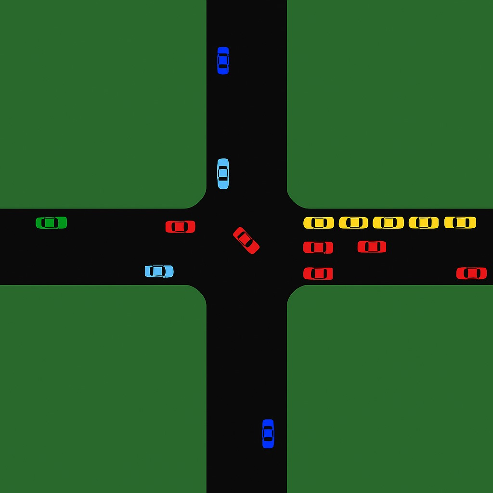
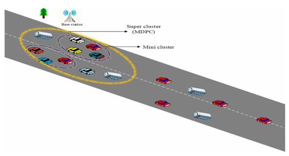

# VANET Emergency Routing Protocol

Implementation of an emergency message dissemination framework for **Vehicular Ad Hoc Networks (VANETs)** using **Supercluster-based routing** and **Firefly Optimization**.

This repository accompanies the research paper:

> **Efficient Emergency Message Propagation in VANETs: A Supercluster and Firefly-Inspired Approach**
>
> Accepted in **IJCNIS**.

---

## Overview

The project simulates emergency message dissemination in Vehicular Ad Hoc Networks (VANETs) and evaluates different routing approaches under various traffic scenarios. The framework integrates clustering, SUMO-based mobility, and Firefly optimization to improve emergency message propagation efficiency.

---

## SUMO Simulation

<p align="center">
  
</p>

---

## Proposed Supercluster Model

<p align="center">
  
</p>

---

## Features

- Road network generation
- Vehicle mobility simulation
- SUMO integration
- Emergency message dissemination
- Supercluster formation
- UMBBFS routing
- Firefly-based routing optimization
- Performance evaluation and visualization

---

## Dataset Configuration

The simulation is configured using CSV files stored in the `datasets/` directory.

### Intersections

```
datasets/intersections/intersections.csv
```

Format

```
<intersection_name>,<x_coordinate>,<y_coordinate>
```

Example

```
I1,100,150
I2,300,150
I3,300,350
```

---

### Roads

```
datasets/roads/roads.csv
```

Format

```
<start_intersection>,<end_intersection>,<speed_limit>,<road_blocked>
```

Example

```
I1,I2,60,False
I2,I3,40,True
```

---

### Vehicles

```
datasets/vehicles/vehicles.csv
```

Format

```
<vehicle_id>;<road_1>,<road_2>,...,<road_n>
```

Example

```
1;I1I2,I2I3,I3I4
```

---

## Implemented Algorithms

- Flooding
- UMBBFS
- UMBBFS-Cluster
- UMBBFS-Cluster-Firefly

Firefly variants:

- Basic Firefly
- Binary Firefly
- Discrete Firefly
- Chaotic Firefly

---

## Performance Metrics

- Packet Delivery Ratio (PDR)
- Average Reaction Time
- Affected Vehicles
- Throughput
- Emergency Message Dissemination Efficiency

---

## Running the Project

Generate datasets

```bash
python create_random_roads_and_vehicles.py
```

Run simulation

```bash
python main.py
```

Generate comparison graphs

```bash
python plot_comparison.py
```

---

## Results

Simulation outputs are stored in the `results/` directory.

The repository includes comparison results for:

- Flooding
- UMBBFS
- UMBBFS-Cluster
- UMBBFS-Cluster-Firefly